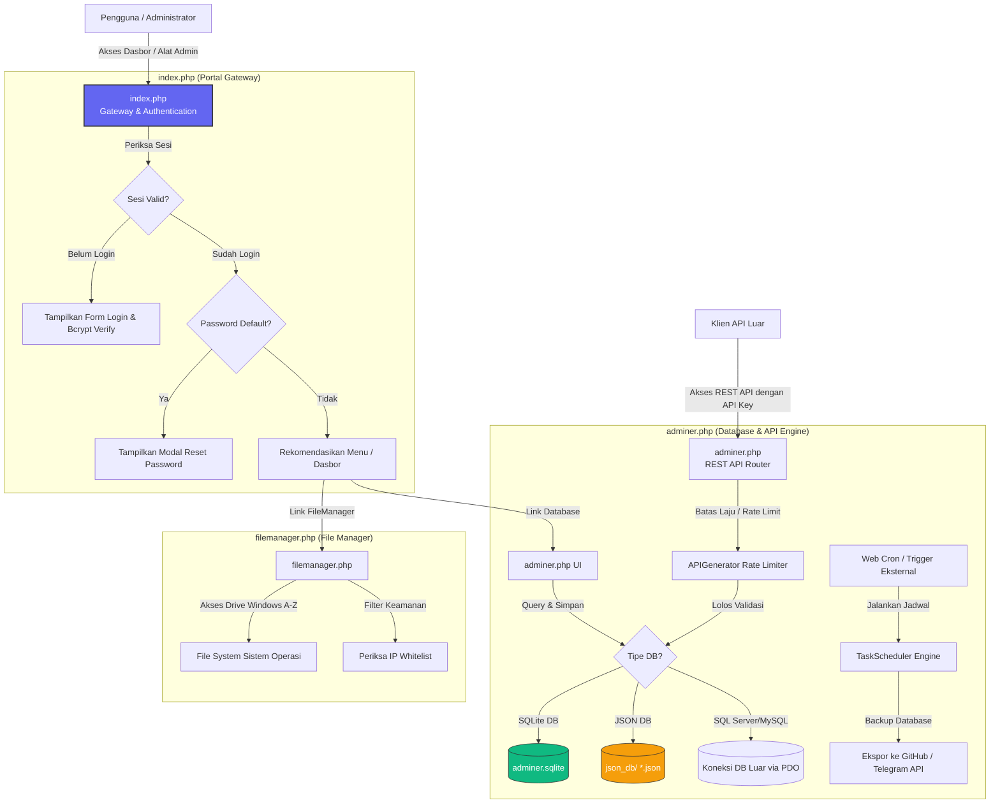

# 🧠 Audit & Dokumentasi Sistem Lengkap: Infinity Setup Portal

Dokumen ini menyajikan analisis menyeluruh (*Project Audit*) dari proyek **Infinity Setup Portal** untuk memberikan gambaran arsitektur, modul, basis data, dan aliran runtime dalam bahasa yang mudah dipahami.

---

## 1. Project Overview & Audit

### Tujuan Project
**Infinity Setup Portal** adalah sebuah gerbang administratif (*unified admin gateway*) berbasis PHP yang dirancang untuk mengonsolidasikan alat manajemen server web ke dalam satu dasbor terpadu. Sistem ini mengamankan akses ke pengelola berkas (*File Manager*) dan administrasi database (*Adminer*) dengan menerapkan otentikasi tunggal (SSO) dan kontrol akses berbasis peran (RBAC).

### Fitur Utama
1. **Otentikasi & Keamanan Terpadu**: Single Sign-On (SSO) untuk semua modul, pembatasan alamat IP dinamis, enkripsi kata sandi menggunakan Bcrypt, dan pemaksaan perubahan kata sandi untuk akun bawaan.
2. **Pengelola Berkas (RFILE Manager)**: Menjelajahi file sistem lokal, berpindah drive logis di Windows (A-Z), mengunggah berkas via drag-and-drop, penyuntingan kode secara langsung (*in-app editor*), pencarian rekursif/konten, serta pendeteksi file duplikat.
3. **Manajer Basis Data (Adminer Plus)**: Manajemen database tradisional (MySQL, SQLite, dll.) yang dilengkapi dengan:
   * **JSON DBMS Engine**: Membaca dan menulis file `.json` sebagai tabel relational (SELECT, INSERT, UPDATE, DELETE).
   * **REST API Generator**: Mempublikasikan tabel database menjadi endpoint API siap pakai secara otomatis dengan manajemen API Key, pembatas laju akses (*rate limiting*), dan logging.
   * **Task Scheduler**: Otomasi eksekusi kueri database dan pencadangan berkas (*backup*) otomatis ke Telegram/GitHub menggunakan sistem penjadwalan mirip Cron.
4. **Pembaruan Mandiri (Self Update)**: Mekanisme mengunduh revisi file terbaru langsung dari repositori GitHub untuk memperbarui kode portal secara otomatis.

### Struktur Folder
Berikut adalah peta direktori proyek:
```text
infinitysetup/
├── index.php             # Gerbang otentikasi utama & dasbor portal
├── filemanager.php       # Modul RFILE Manager (Manajemen Berkas)
├── adminer.php           # Modul Adminer Plus (Database, API, Scheduler)
├── adminer.sqlite        # Basis data konfigurasi & otentikasi sistem
├── link.txt              # Sumber URL GitHub untuk sistem pembaruan mandiri
├── .htaccess             # Aturan konfigurasi server web Apache
├── .fm_whitelist.json    # Daftar putih IP untuk modul File Manager
├── json_db/              # Direktori penyimpanan database berbasis JSON
├── sqlite_db/            # Direktori penyimpanan file SQLite pengguna
├── copy_sqlite_db/       # Staging area untuk salinan/backup SQLite
├── temp_backups/         # Lokasi penyimpanan sementara hasil backup
└── assets/               # Folder aset frontend offline
    └── vendor/           # Pustaka frontend (Ace, Bootstrap, DataTables, dll.)
```

### Teknologi yang Digunakan
* **Backend**: PHP (Native dengan PDO SQLite / MySQL).
* **Frontend**: HTML5, Vanilla CSS, Bootstrap 5.3, JavaScript (ES6+).
* **Database**: SQLite 3 (untuk konfigurasi sistem) & JSON/MySQL/PostgreSQL (untuk target operasional).
* **Library Eksternal**: Ace Editor (editor kode), DataTables (tabel interaktif), Dropzone (upload drag-and-drop), FontAwesome (ikon), Highlight.js (syntax coloring), Leaflet (pemetaan koordinat EXIF gambar).

### Dependensi Penting
Semua dependensi dimuat secara lokal di folder `assets/vendor/` untuk menjamin portabilitas tinggi dan kemampuan berjalan di jaringan lokal tanpa internet (offline):
1. **Ace Editor (`ace.js`)**: Digunakan oleh File Manager untuk menyunting berkas teks/kode secara real-time langsung dari browser.
2. **DataTables (`jquery.dataTables.min.js`)**: Digunakan untuk rendering daftar data, pencarian cepat, pencatatan log API, dan penyaringan logs.
3. **Dropzone (`dropzone.min.js`)**: Digunakan untuk mengunggah banyak berkas secara asinkron.
4. **Bootstrap (`bootstrap.bundle.min.js`)**: Framework CSS utama yang membangun antarmuka admin, modal, dan grid responsif.

### Cara Menjalankan Project
Proyek ini sangat portabel dan tidak membutuhkan instalasi yang rumit:
1. Letakkan seluruh folder proyek ke dalam direktori server web Anda (seperti Laragon `www/` atau XAMPP `htdocs/`).
2. Pastikan ekstensi PHP `pdo_sqlite` dan `curl` sudah diaktifkan di file `php.ini`.
3. Jalankan server web (Apache/Nginx).
4. Buka browser dan arahkan ke alamat web proyek (misal: `http://localhost/infinitysetup`).
5. Masuk menggunakan akun admin bawaan:
   * **Username**: `admin`
   * **Password**: `admin123`
6. Sistem akan langsung meminta Anda mengubah password bawaan demi alasan keamanan.

### Entry Point & Environment Variable
* **Entry Point**: `index.php` adalah gerbang utama yang menyaring sesi otentikasi sebelum mengalihkan pengguna ke modul administrasi lainnya.
* **Environment Variable**: Proyek ini **tidak menggunakan file `.env`**. Seluruh konfigurasi sensitif (kredensial database operasional, API Key, jadwal Cron, pengaturan Telegram/GitHub) disimpan dengan aman di dalam database SQLite lokal (`adminer.sqlite`) di dalam tabel `settings`.

### Database yang Digunakan
1. **`adminer.sqlite` (SQLite)**: Menyimpan skema pengguna (`users`), parameter kredensial DB (`settings`), dan riwayat backup (`backup_history`).
2. **JSON Databases (`json_db/`)**: Berkas-berkas berformat `.json` yang dibaca-tulis layaknya tabel database relasional oleh kelas `JsonDatabase`.

### API yang Tersedia
API di-handle secara dinamis oleh kelas `APIGenerator` di dalam `adminer.php`:
* **Routing Endpoint**: `adminer.php/api/{nama_tabel}`
* **Metode**: 
  * `GET /api/{tabel}`: Mengambil seluruh baris data (mendukung parameter `page`, `per_page`, `sort`, `order`).
  * `GET /api/{tabel}/{id}`: Mengambil satu rekaman data berdasarkan ID.
  * `POST /api/{tabel}`: Menambahkan data baru.
  * `PUT /api/{tabel}/{id}`: Mengubah data yang sudah ada berdasarkan ID.
  * `DELETE /api/{tabel}/{id}`: Menghapus data berdasarkan ID.
* **Header Wajib**: `X-API-Key: {kunci_api_anda}`

### Kemungkinan Bug / Technical Debt
* **Monolith Massive Files**: Berkas `filemanager.php` dan `adminer.php` adalah berkas tunggal berukuran besar (masing-masing 10k+ dan 20k+ baris kode). Hal ini mempersulit pelacakan git diff dan pemeliharaan kode jangka panjang.
* **In-Place File Overwriting**: Fungsi pembaruan mandiri mengunduh kode langsung dari GitHub dan menimpa file lokal saat server berjalan (`file_put_contents`). Jika proses ini terinterupsi di tengah jalan, kode aplikasi dapat menjadi rusak (*corrupted*).
* **JSON DB Performance Scaling**: Driver `JsonDatabase` memuat seluruh isi file JSON ke dalam memori server untuk melakukan query, pengurutan, dan modifikasi data. Jika file JSON tumbuh melebihi beberapa megabyte, performa pembacaan dan penggunaan memori PHP akan memburuk.

---

## 2. System Architecture Diagram

Berikut adalah arsitektur diagram sistem yang menggambarkan hubungan antara pengguna, portal keamanan, dan komponen backend:



---

## 3. Feature Map & Hubungan Antar Module

Sistem ini membagi wewenangnya ke dalam 3 modul kerja utama yang terhubung erat melalui session state:

```text
+-----------------------+      Menggunakan Sesi Yang Sama      +-------------------------+
|       index.php       | ===================================> |     filemanager.php     |
| (Otentikasi & Dasbor) |                                      |  (Manajemen File & OS)  |
+-----------------------+                                      +-------------------------+
            ||                                                              ||
            || Menjaga Kredensial DB                                        || Mengedit Kode Sumber
            \/                                                              \/
+----------------------------------------------------------------------------------------+
|                                      adminer.php                                       |
|               (Database Client, JSON Engine, API Generator, Task Scheduler)            |
+----------------------------------------------------------------------------------------+
```

### Pemetaan Detail Fitur

#### 1. Modul Keamanan & Akun
* **Fitur**: Login Pengguna, Validasi Peran (Admin/User), dan Reset Sandi Wajib.
* **File Pengendali**: `index.php` (fungsi `is_authenticated()`, `has_permission()`, `show_login_ui()`).
* **Kueri API / POST**: Form POST `auth_login` (proses verifikasi kata sandi) & `change_password`.
* **Tabel Terkait**: Tabel `users` pada basis data `adminer.sqlite`.

#### 2. Modul File & Directory Explorer
* **Fitur**: Navigasi Berkas, Pencarian Rekursif, Pengunggahan Dropzone, dan Deteksi Duplikat File.
* **File Pengendali**: `filemanager.php`.
* **Kueri API / POST**: AJAX Request tipe `get_folders`, `search`, `find_duplicates`, dan `delete` yang divalidasi dengan token CSRF (`$_SESSION['token']`).
* **Tabel Terkait**: Tidak menggunakan tabel database relasional; berkas langsung berinteraksi dengan API File System PHP (`scandir`, `unlink`, `RecursiveDirectoryIterator`).

#### 3. REST API Engine & Generator
* **Fitur**: Eksposur tabel basis data ke endpoint HTTP berformat JSON.
* **File Pengendali**: `adminer.php` (kelas `APIGenerator`).
* **Kueri API / POST**: Mendengar HTTP request pada URL pattern `/api/{table}` dengan otentikasi header `X-API-Key`.
* **Tabel Terkait**: Membaca parameter API Key dari tabel `settings` (kunci `api_keys`) di basis data `adminer.sqlite` dan melakukan query pada target tabel basis data.

#### 4. Penjadwal Tugas (Task Scheduler)
* **Fitur**: Pencadangan berkas otomatis (*auto-backup*), pembersihan log, dan eksekusi kueri berkala.
* **File Pengendali**: `adminer.php` (kelas `TaskScheduler`).
* **Kueri API / POST**: Endpoint eksternal `adminer.php?cron=1&key={secret_key}`.
* **Tabel Terkait**: Tabel `backup_history` pada `adminer.sqlite`.

---

## 4. Codebase Documentation

Berikut penjelasan detail dari modul utama dan berkas konfigurasi di dalam proyek:

### 1. `index.php`
* **Peran**: Gateway Utama & Dasbor Aplikasi.
* **Fungsi Penting**:
  * `get_auth_db()`: Menghubungkan ke `adminer.sqlite` menggunakan driver PDO SQLite. Jika file SQLite belum ada, fungsi ini akan membuat struktur database baru secara otomatis dan menanamkan akun default (`admin`).
  * `is_authenticated()`: Memastikan data sesi pengguna (`user_id` dan `username`) terdaftar dan valid.
  * `has_permission($app, $min_level)`: Memeriksa apakah pengguna memiliki hak akses (Read, Write, Full) ke modul tertentu (misalnya File Manager atau database).
  * *Update Handler*: Mendengarkan request `update_action` untuk mengunduh daftar berkas terbaru dari berkas teks eksternal yang di-host di repositori GitHub, lalu memperbarui file sistem lokal secara real-time.

### 2. `filemanager.php`
* **Peran**: Pengendali Berkas Sistem Host.
* **Fungsi Penting**:
  * `fm_get_logical_drives()`: Mendeteksi huruf drive logis yang tersedia (khusus sistem operasi Windows) untuk navigasi file lintas-drive.
  * `fm_rdelete()`: Menghapus folder dan file secara rekursif.
  * *AJAX Handler*: Menangani request asinkron untuk mempercepat performa rendering antarmuka pengguna tanpa memuat ulang seluruh halaman web.

### 3. `adminer.php`
* **Peran**: Administrasi Database, Scheduler, & API Engine.
* **Fungsi Penting**:
  * `JsonDatabase`: Sebuah driver basis data buatan sendiri yang mensimulasikan query SQL (select, insert, update, delete) pada file `.json` lokal.
  * `APIGenerator`: Menerima REST API request, memvalidasi API Key, menghitung laju permintaan per jam (*rate limit*), dan mengembalikan data dalam format JSON.
  * `TaskScheduler`: Mengelola tugas berkala, mem-parsing format waktu cron, dan mencatat riwayat eksekusi ke file log eksternal `scheduler_logs.json`.
  * `load_config()` & `save_config()`: Membaca dan menyimpan informasi konfigurasi global ke dalam tabel `settings` milik database `adminer.sqlite`.
