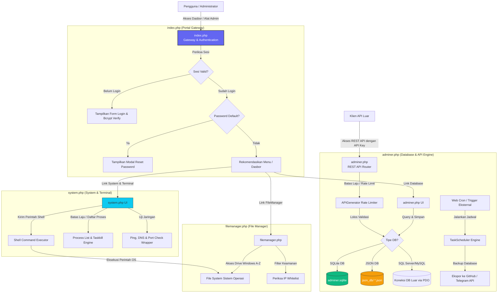
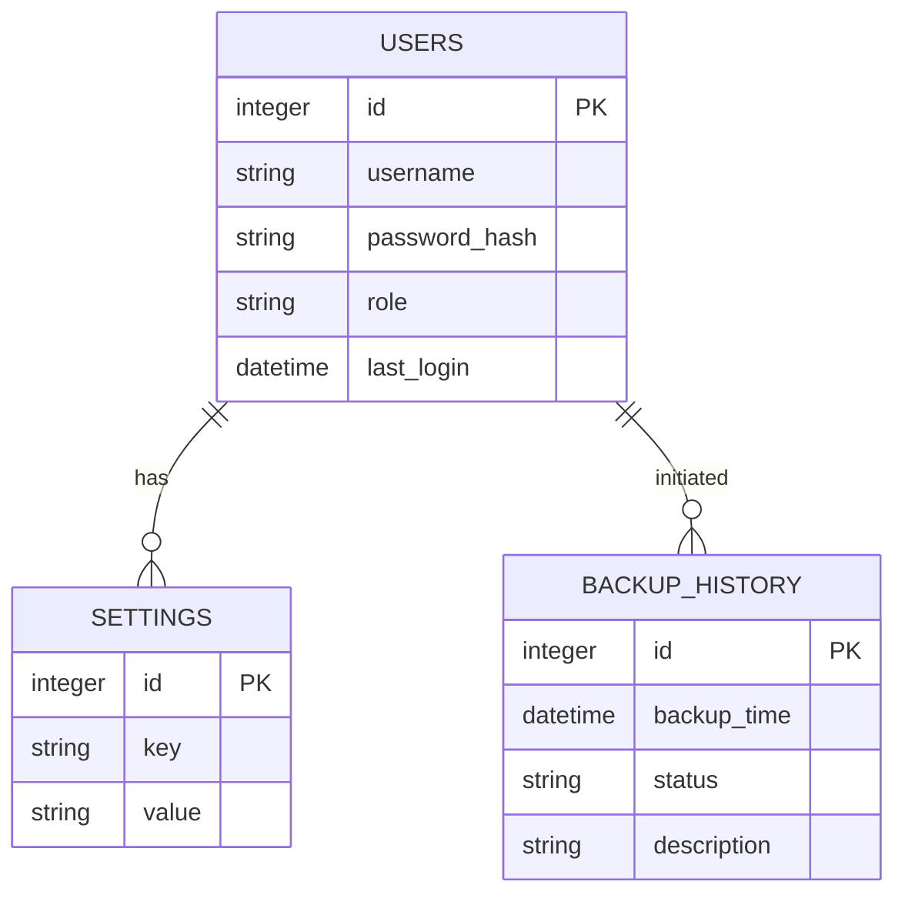
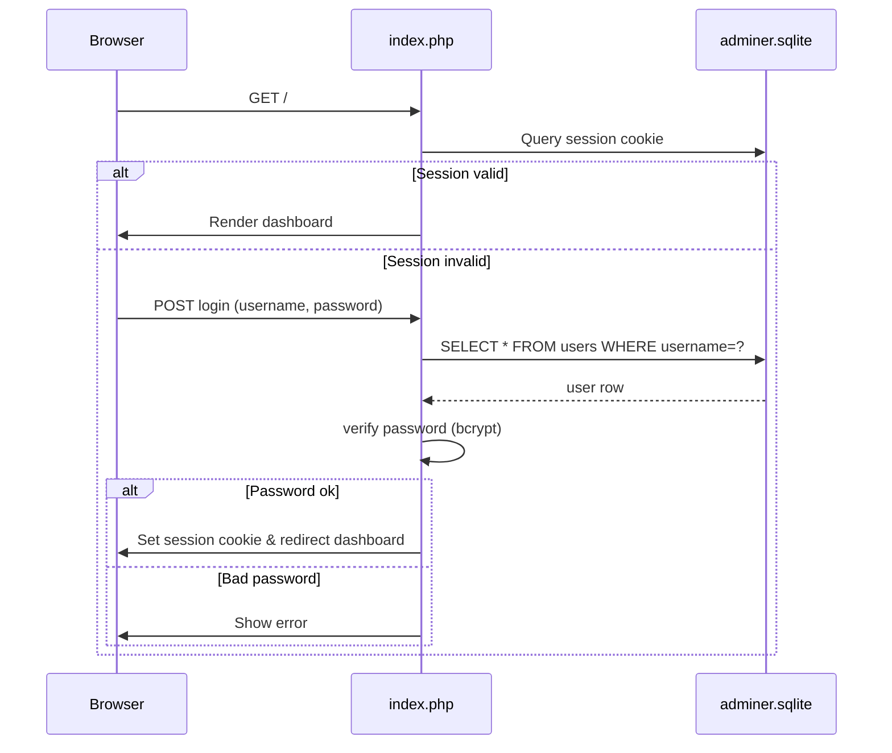
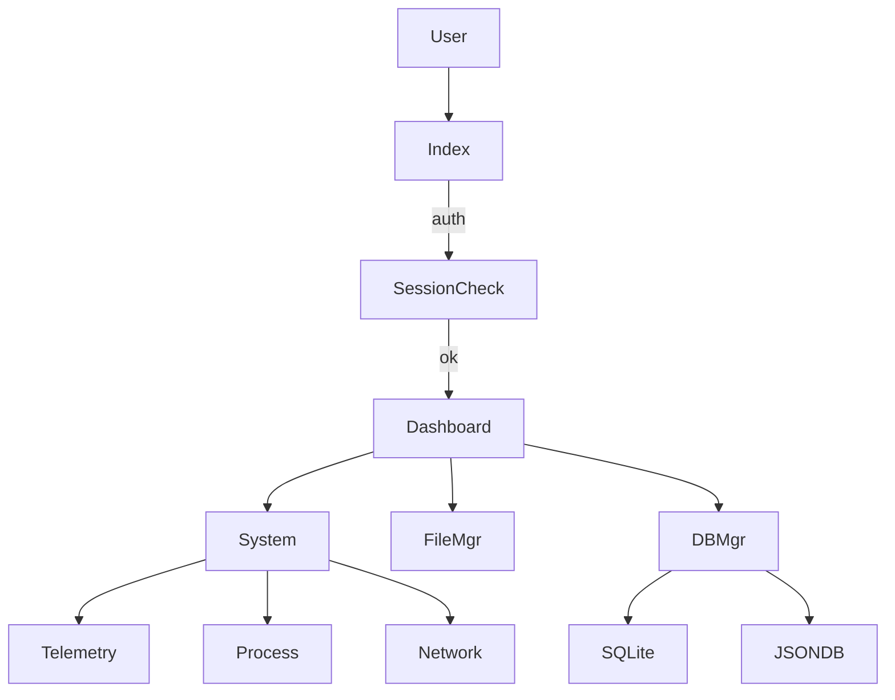

# 🧠 Audit & Dokumentasi Sistem Lengkap: Infinity Setup Portal

Dokumen ini menyajikan analisis menyeluruh (*Project Audit*) dari proyek **Infinity Setup Portal** untuk memberikan gambaran arsitektur, modul, basis data, dan aliran runtime dalam bahasa yang mudah dipahami.

---

## 1. Project Overview & Audit

### Tujuan Project
**Infinity Setup Portal** adalah sebuah gerbang administratif (*unified admin gateway*) berbasis PHP yang dirancang untuk mengonsolidasikan alat manajemen server web ke dalam satu dasbor terpadu. Sistem ini mengamankan akses ke pengelola berkas (*File Manager*), administrasi database (*Adminer*), serta utilitas sistem/terminal (*System & Terminal*) dengan menerapkan otentikasi tunggal (SSO) dan kontrol akses berbasis peran (RBAC).

### Fitur Utama
1. **Otentikasi & Keamanan Terpadu**: Single Sign-On (SSO) untuk semua modul, pembatasan alamat IP dinamis, enkripsi kata sandi menggunakan Bcrypt, dan pemaksaan perubahan kata sandi untuk akun bawaan.
2. **Pengelola Berkas (RFILE Manager)**: Menjelajahi file sistem lokal, berpindah drive logis di Windows (A-Z), mengunggah berkas via drag-and-drop, penyuntingan kode secara langsung (*in-app editor*), pencarian rekursif/konten, serta pendeteksi file duplikat.
3. **Manajer Basis Data (Adminer Plus)**: Manajemen database tradisional (MySQL, SQLite, dll.) yang dilengkapi dengan:
   * **JSON DBMS Engine**: Membaca dan menulis file `.json` sebagai tabel relational (SELECT, INSERT, UPDATE, DELETE).
   * **REST API Generator**: Mempublikasikan tabel database menjadi endpoint API siap pakai secara otomatis dengan manajemen API Key, pembatas laju akses (*rate limiting*), dan logging.
   * **Task Scheduler**: Otomasi eksekusi kueri database dan pencadangan berkas (*backup*) otomatis ke Telegram/GitHub menggunakan sistem penjadwalan mirip Cron.
4. **Administrasi Sistem & Terminal (Console & Telemetry)**:
   * **Web Console**: Eksekusi perintah shell langsung dari antarmuka web dengan dukungan persistensi direktori aktif (*current working directory*).
   * **Process Manager**: Pemantauan proses sistem aktif serta opsi untuk menghentikan (*kill*) proses secara langsung.
   * **Live Telemetry**: Pemantauan real-time untuk CPU Load, RAM Utilization, dan Disk Storage.
   * **Network Tools**: Integrasi peralatan uji jaringan (`ping`, `nslookup`, dan TCP Port Checker).
5. **Pembaruan Mandiri (Self Update)**: Mekanisme mengunduh revisi file terbaru langsung dari repositori GitHub untuk memperbarui kode portal secara otomatis.

### Struktur Folder
Berikut adalah peta direktori proyek:
```text
infinitysetup/
├── index.php             # Gerbang otentikasi utama & dasbor portal
├── filemanager.php       # Modul RFILE Manager (Manajemen Berkas)
├── adminer.php           # Modul Adminer Plus (Database, API, Scheduler)
├── system.php            # Modul System Administration & Terminal (Console, Processes, Network)
├── adminer.sqlite        # Basis data konfigurasi & otentikasi sistem
├── link.txt              # Sumber URL GitHub untuk sistem pembaruan mandiri
├── .htaccess             # Aturan konfigurasi server web Apache
├── .fm_whitelist.json    # Daftar putih IP untuk modul File Manager
├── json_db/              # Direktori penyimpanan database berbasis JSON
├── sqlite_db/            # Direktori penyimpanan file SQLite pengguna
├── copy_sqlite_db/       # Staging area untuk salinan/backup SQLite
├── temp_backups/         # Lokasi penyimpanan sementara hasil backup
└── assets/               # Folder aset frontend offline
    └── vendor/           # Pustaka frontend (Ace, Bootstrap, DataTables, dll.)
```

### Teknologi yang Digunakan
* **Backend**: PHP (Native dengan PDO SQLite / MySQL).
* **Frontend**: HTML5, Vanilla CSS, Bootstrap 5.3, JavaScript (ES6+).
* **Database**: SQLite 3 (untuk konfigurasi sistem) & JSON/MySQL/PostgreSQL (untuk target operasional).
* **Library Eksternal**: Ace Editor (editor kode), DataTables (tabel interaktif), Dropzone (upload drag-and-drop), FontAwesome (ikon), Highlight.js (syntax coloring), Leaflet (pemetaan koordinat EXIF gambar).

### Dependensi Penting
Semua dependensi dimuat secara lokal di folder `assets/vendor/` untuk menjamin portabilitas tinggi dan kemampuan berjalan di jaringan lokal tanpa internet (offline):
1. **Ace Editor (`ace.js`)**: Digunakan oleh File Manager untuk menyunting berkas teks/kode secara real-time langsung dari browser.
2. **DataTables (`jquery.dataTables.min.js`)**: Digunakan untuk rendering daftar data, pencarian cepat, pencatatan log API, dan penyaringan logs.
3. **Dropzone (`dropzone.min.js`)**: Digunakan untuk mengunggah banyak berkas secara asinkron.
4. **Bootstrap (`bootstrap.bundle.min.js`)**: Framework CSS utama yang membangun antarmuka admin, modal, dan grid responsif.

### Cara Menjalankan Project
Proyek ini sangat portabel dan tidak membutuhkan instalasi yang rumit:
1. Letakkan seluruh folder proyek ke dalam direktori server web Anda (seperti Laragon `www/` atau XAMPP `htdocs/`).
2. Pastikan ekstensi PHP `pdo_sqlite` dan `curl` sudah diaktifkan di file `php.ini`.
3. Jalankan server web (Apache/Nginx).
4. Buka browser dan arahkan ke alamat web proyek (misal: `http://localhost/infinitysetup`).
5. Masuk menggunakan akun admin bawaan:
   * **Username**: `admin`
   * **Password**: `admin123`
6. Sistem akan langsung meminta Anda mengubah password bawaan demi alasan keamanan.

### Entry Point & Environment Variable
* **Entry Point**: `index.php` adalah gerbang utama yang menyaring sesi otentikasi sebelum mengalihkan pengguna ke modul administrasi lainnya.
* **Environment Variable**: Proyek ini **tidak menggunakan file `.env`**. Seluruh konfigurasi sensitif (kredensial database operasional, API Key, jadwal Cron, pengaturan Telegram/GitHub) disimpan dengan aman di dalam database SQLite lokal (`adminer.sqlite`) di dalam tabel `settings`.

### Database yang Digunakan
1. **`adminer.sqlite` (SQLite)**: Menyimpan skema pengguna (`users`), parameter kredensial DB (`settings`), dan riwayat backup (`backup_history`).
2. **JSON Databases (`json_db/`)**: Berkas-berkas berformat `.json` yang dibaca-tulis layaknya tabel database relasional oleh kelas `JsonDatabase`.

### API yang Tersedia
API di-handle secara dinamis oleh modul di dalam proyek:
* **Database API Router (`adminer.php`)**: `adminer.php/api/{nama_tabel}` (Mendukung GET, POST, PUT, DELETE).
* **System Utilities API (`system.php`)**: `system.php?api={endpoint}` (Mengelola `terminal_execute`, `get_telemetry`, `process_list`, `process_kill`, dan `network_tool`).

### Kemungkinan Bug / Technical Debt
* **Monolith Massive Files**: Berkas `filemanager.php`, `adminer.php`, dan `system.php` adalah berkas tunggal berukuran besar. Hal ini mempersulit pelacakan git diff dan pemeliharaan kode jangka panjang.
* **In-Place File Overwriting**: Fungsi pembaruan mandiri mengunduh kode langsung dari GitHub dan menimpa file lokal saat server berjalan (`file_put_contents`). Jika proses ini terinterupsi di tengah jalan, kode aplikasi dapat menjadi rusak (*corrupted*).
* **JSON DB Performance Scaling**: Driver `JsonDatabase` memuat seluruh isi file JSON ke dalam memori server untuk melakukan query, pengurutan, dan modifikasi data. Jika file JSON tumbuh melebihi beberapa megabyte, performa pembacaan dan penggunaan memori PHP akan memburuk.

---

## 2. System Architecture Diagram

Berikut adalah arsitektur diagram sistem yang menggambarkan hubungan antara pengguna, portal keamanan, dan komponen backend:



---

## 3. Feature Map & Hubungan Antar Module

Sistem ini membagi wewenangnya ke dalam 4 modul kerja utama yang terhubung erat melalui session state:

```text
+-----------------------+      Menggunakan Sesi Yang Sama      +-------------------------+
|       index.php       | ===================================> |     filemanager.php     |
| (Otentikasi & Dasbor) | ===\                                 |  (Manajemen File & OS)  |
+-----------------------+     \                                +-------------------------+
            ||                 \ Sesi Verifikasi SSO
            ||                  \=============> +-------------------------+
            || Menjaga Kredensial DB            |       system.php        |
            \/                                  | (Terminal & OS Control) |
+---------------------------------------------+ +-------------------------+
|                 adminer.php                 |
| (Database, JSON Engine, API Generator, Cron)|
+---------------------------------------------+
```

### Pemetaan Detail Fitur

#### 1. Modul Keamanan & Akun
* **Fitur**: Login Pengguna, Validasi Peran (Admin/User), dan Reset Sandi Wajib.
* **File Pengendali**: `index.php` (fungsi `is_authenticated()`, `has_permission()`, `show_login_ui()`).
* **Kueri API / POST**: Form POST `auth_login` (proses verifikasi kata sandi) & `change_password`.
* **Tabel Terkait**: Tabel `users` pada basis data `adminer.sqlite`.

#### 2. Modul File & Directory Explorer
* **Fitur**: Navigasi Berkas, Pencarian Rekursif, Pengunggahan Dropzone, dan Deteksi Duplikat File.
* **File Pengendali**: `filemanager.php`.
* **Kueri API / POST**: AJAX Request tipe `get_folders`, `search`, `find_duplicates`, dan `delete` yang divalidasi dengan token CSRF (`$_SESSION['token']`).
* **Tabel Terkait**: Berinteraksi langsung dengan API File System PHP (`scandir`, `unlink`, `RecursiveDirectoryIterator`).

#### 3. Modul Terminal & System Telemetry
* **Fitur**: Console Shell interaktif, Process Manager (Kill Process), Live monitoring (CPU/RAM/Disk), dan perkakas jaringan (Ping/DNS/Port check).
* **File Pengendali**: `system.php`.
* **Kueri API / POST**: Endpoint API `system.php?api={action}` (misal: action `terminal_execute` via POST).
* **Tabel Terkait**: Tidak menggunakan tabel database relasional; berinteraksi dengan utilitas command line sistem operasi host (`wmic`, `ps`, `tasklist`, `taskkill`, `ping`).

#### 4. REST API Engine & Generator
* **Fitur**: Eksposur tabel basis data ke endpoint HTTP berformat JSON.
* **File Pengendali**: `adminer.php` (kelas `APIGenerator`).
* **Kueri API / POST**: Mendengar HTTP request pada URL pattern `/api/{table}` dengan otentikasi header `X-API-Key`.
* **Tabel Terkait**: Membaca parameter API Key dari tabel `settings` (kunci `api_keys`) di basis data `adminer.sqlite`.

#### 5. Penjadwal Tugas (Task Scheduler)
* **Fitur**: Pencadangan berkas otomatis (*auto-backup*), pembersihan log, dan eksekusi kueri berkala.
* **File Pengendali**: `adminer.php` (kelas `TaskScheduler`).
* **Kueri API / POST**: Endpoint eksternal `adminer.php?cron=1&key={secret_key}`.
* **Tabel Terkait**: Tabel `backup_history` pada `adminer.sqlite`.

---

## 4. Codebase Documentation

Berikut penjelasan detail dari modul utama dan berkas konfigurasi di dalam proyek:

### 1. `index.php`
* **Peran**: Gateway Utama & Dasbor Aplikasi.
* **Fungsi Penting**:
  * `get_auth_db()`: Menghubungkan ke `adminer.sqlite` menggunakan driver PDO SQLite.
  * `is_authenticated()`: Memastikan data sesi pengguna terdaftar dan valid.
  * `has_permission($app, $min_level)`: Memeriksa tingkat hak akses pengguna.
  * *Update Handler*: Mengunduh pembaruan modul secara asinkron dari GitHub.

### 2. `filemanager.php`
* **Peran**: Pengendali Berkas Sistem Host.
* **Fungsi Penting**:
  * `fm_get_logical_drives()`: Mendeteksi huruf drive logis di Windows.
  * `fm_rdelete()`: Penghapusan berkas/folder rekursif.

### 3. `system.php`
* **Peran**: Modul Konsol Terminal, Monitor Proses, Telemetri Host, dan Alat Uji Jaringan.
* **Fungsi Penting**:
  * `execute_command($cmd, $cwd)`: Membuka proses baru menggunakan `proc_open` untuk mengaktifkan eksekusi perintah shell pada sistem operasi dengan aman.
  * *Telemetry API (`get_telemetry`)*: Mengkueri detail hardware (CPU Load via wmic/proc stat, RAM via WMI/meminfo, disk free space) untuk menghasilkan data statistik waktu nyata.
  * *Process Engine (`process_list` & `process_kill`)*: Parser untuk `tasklist` dan `ps aux` dengan opsi penghentian proses via PID.
  * *Network Utility (`network_tool`)*: Wrapper lokal untuk utilitas CLI jaringan standar.

### 4. `adminer.php`
* **Peran**: Administrasi Database, Scheduler, & API Engine.
* **Fungsi Penting**:
  * `JsonDatabase`: Driver JSON database lokal berkinerja SQL-like.
  * `APIGenerator`: REST API compiler untuk mengekspos database relasional dengan rate limiter.
  * `TaskScheduler`: Sistem manajemen tugas berkala otomatis.
## 5. Database Schema / ERD

Berikut adalah skema basis data utama yang digunakan oleh portal:



### Penjelasan Tabel
- **users**: Menyimpan kredensial dan peran.
- **settings**: Menyimpan konfigurasi sistem (API keys, kredensial db eksternal, dll.).
- **backup_history**: Riwayat pencadangan otomatis.

## 6. Authentication Flow



Proses login menggunakan **bcrypt** dan setelah berhasil, pengguna dipaksa mengganti password default.

## 7. Entry Points & Runtime Flow

- **index.php** – entry point utama, memeriksa otentikasi, menampilkan menu.
- **system.php** – API endpoint untuk console, telemetry, process, network.
- **adminer.php** – API router & task scheduler.
- **filemanager.php** – File explorer UI.
- Semua modul mengakses sesi yang sama (`$_SESSION`) sehingga status login terjaga di seluruh UI.

## 8. Additional Mermaid Diagrams

### System Architecture (repeated for clarity)


